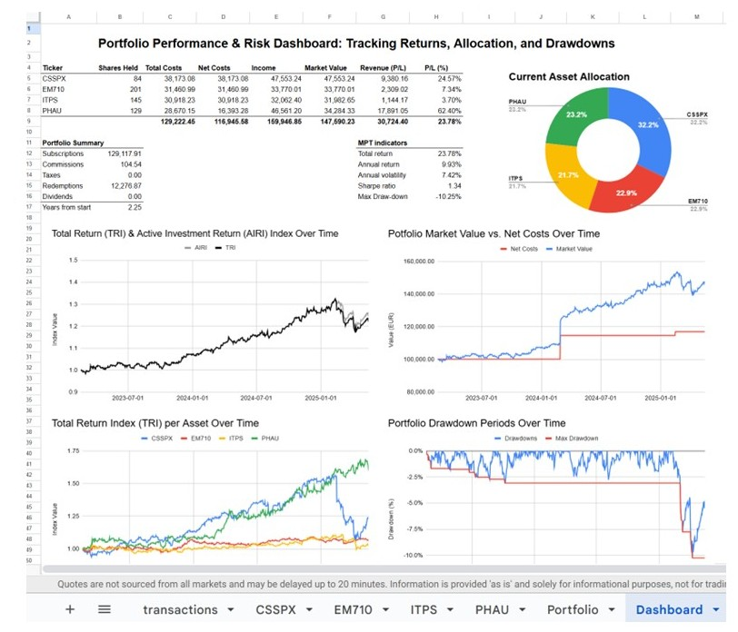
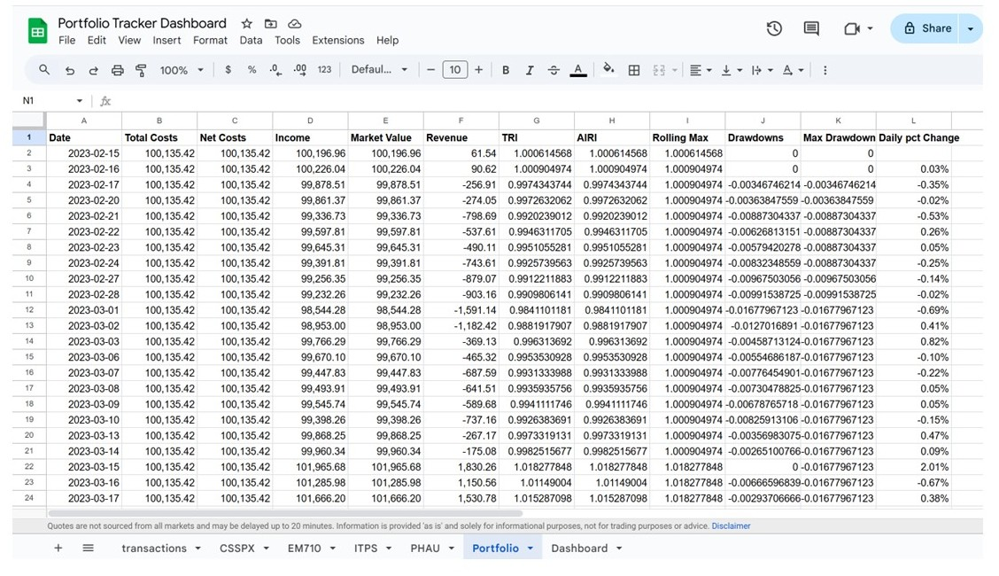

# Portfolio Google Sheets Dashboard

A dynamic portfolio tracker built in **Google Sheets**, providing real-time insights into investment performance, asset allocation, and risk metrics. Inspired by ideas from my previous Python Portfolio Tracker project.

---

## 📊 Overview

This dashboard consists of interactive tables and charts across multiple Google Sheets, offering a comprehensive view of:

- Individual asset performance
- Portfolio-level analytics
- Risk and return indicators
- Historical trends

---

## ✨ Key Features

- **Real-Time Snapshot**: Portfolio view with market value, cost, profit/loss (absolute and %).
- **Summary Table**: Key aggregates like subscriptions, redemptions, commissions, dividends, and portfolio age.
- **Risk Metrics (MPT)**: Includes total/annual return, volatility, Sharpe ratio, and max drawdown.
- **Dynamic Asset Allocation**: Pie chart based on market value.
- **Performance Over Time**: Line charts for TRI and AIRI metrics.
- **Capital Growth**: Market Value vs. Net Cost over time.
- **Individual Asset Trends**: TRI line charts for each asset.
- **Active Risk**: AIRI drawdowns and max drawdown analysis.

---

## 🧮 Data Structure

**Sheets Used:**

1. **`transactions`** – Records all trades with columns: `Ticker`, `Date`, `Type`, `Shares`, `Amount`, `Commissions`, `Taxes`.
2. **Ticker Sheets** – One for each asset (e.g., `CSSPX`, `EM710`) with:
   - Price history via `GOOGLEFINANCE`
   - Calculated metrics: Shares Held, TRI, AIRI, etc.
3. **`Portfolio`** – Aggregates all ticker data, computes portfolio-wide metrics.
4. **`Dashboard`** – Displays visualizations using data from the `Portfolio` sheet.

---

## 🧠 Key Calculations

### Cross-Sheet Aggregation
- Uses `ARRAYFORMULA` + `VLOOKUP` to align and sum data across ticker sheets.
- `IFERROR` ensures robustness for missing dates.

### Cumulative Positions
- `SUMIF` tracks shares over time by ticker.

### Rolling Max & Drawdown
- `SCAN` + `LAMBDA` functions track AIRI peaks and drawdowns dynamically.

### Return Metrics

**Inputs:**

| Incomes               | Costs         |
|-----------------------|---------------|
| Market Value (today)  | Subscriptions |
| Redemptions           | Commissions   |
| Dividends             | Taxes         |

**Derived Metrics:**

- `Total Costs = Subscriptions + Commissions + Taxes`
- `Net Costs = Total Costs - (Redemptions + Dividends)`
- `Revenue = Incomes - Total Costs`

**Indices:**

- TRI = Incomes / Total Costs → Total Return
- AIRI = Market Value / Net Costs → Unrealized Return

---

## 🚀 How to Use

1. **Make a Copy of the Template**  
   👉 [Click here to copy the Google Sheets Template](https://docs.google.com/spreadsheets/d/1cFiPoeBIn5ohLJLE50NH_tQfu3tKk0uCE3Vec9xk4-o/copy)

2. **Input Your Transactions**  
   In the `transactions` sheet, replace the sample data with your own:
   - `Ticker`, `Date` (YYYY-MM-DD), `Type (Buy/Sell)`, `Shares`, `Amount`, `Commissions`, `Taxes`.

3. **Verify Ticker Sheets**  
   Each ticker sheet (e.g., `CSSPX`) pulls historical prices using the `GOOGLEFINANCE` function.
   - Ensure the sheet name matches your asset’s ticker.

4. **View the Dashboard**  
   The `Dashboard` sheet displays all key tables and charts.
   - No input is needed here — it updates automatically.

5. **Enable GOOGLEFINANCE**  
   - Ensure `GOOGLEFINANCE` is working in your Google Sheets environment.

---

## 📸 Screenshots

### Dashboard

### Portfolio Sheet
 

---

## 📬 Contact

For feedback, suggestions, or collaboration:

- **Carlo Signorini**
- [LinkedIn Profile](https://www.linkedin.com/in/carlosignorini/)

---

## 🙏 Acknowledgments

This project benefited from the use of AI assistants such as **Gemini** and **ChatGPT**, which were used to validate complex Google Sheets formulas and evaluate trade-offs between different implementation strategies. Their input helped streamline development and enhance formula efficiency.

---

## 📄 License

This project is licensed under the **MIT License**.

> You are free to use, modify, and distribute this project for personal or commercial purposes. Attribution is appreciated but not required.

---
